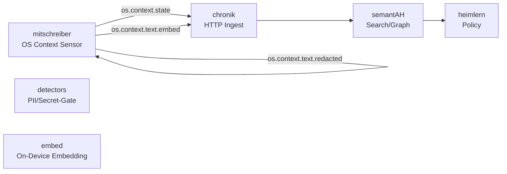

# Architektur

## Übersicht

---

## Komponenten

| Modul               | Aufgabe                                             |
| ------------------- | --------------------------------------------------- |
| `mitschreiber/core` | OS-Events sammeln (Fenster, Fokus, Input-Aktivität) |
| `detectors/pii`     | Regex + NER-basierte PII-Erkennung                  |
| `embed/`            | Embedding & Keyphrase-Extraktion (on-device)        |
| `sinks/`            | WAL/RAM-Speicher, Chronik-HTTP-Client               |
| `config/`           | `.env` + Just-Integration                           |

---

## Betriebsfluss

1. **Sampler** liest Fokus & Aktivität (je 5 s)
2. **optional Text-Watcher** → Snippet-Buffer
3. **PII-Gate** prüft Tokens; ggf. maskiert
4. **Embedding-Worker** erzeugt Vektoren + Keyphrases
5. **Sink-Router**

   * persistiert `state` / `embed`
   * verwirft oder flüchtig speichert `redacted`
6. **HTTP-Client** sendet Events an `chronik`

---

## Security

* Kein Zugriff auf Dateisysteminhalte
* Keine Netzwerk-Verbindungen außer `chronik`
* Fail-Closed: Bei Gate-Fehler → kein Persist, kein Send
