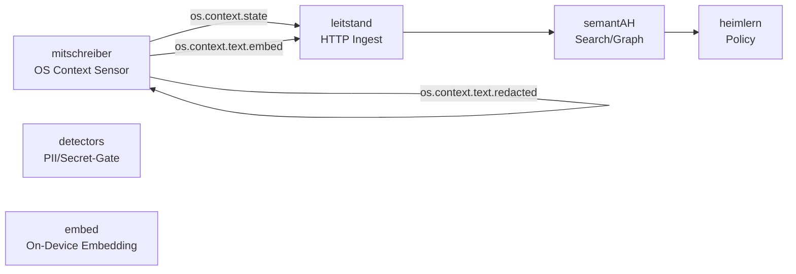

### 📄 docs/architecture.md

**Größe:** 1 KB | **md5:** `83866236f9238e2e70e2df5798dc635f`

```markdown
# Architektur

## Übersicht



---

## Komponenten

| Modul               | Aufgabe                                             |
| ------------------- | --------------------------------------------------- |
| `mitschreiber/core` | OS-Events sammeln (Fenster, Fokus, Input-Aktivität) |
| `detectors/pii`     | Regex + NER-basierte PII-Erkennung                  |
| `embed/`            | Embedding & Keyphrase-Extraktion (on-device)        |
| `sinks/`            | WAL/RAM-Speicher, Leitstand-HTTP-Client             |
| `config/`           | `.env` + Just-Integration                           |

---

## Betriebsfluss

1. **Sampler** liest Fokus & Aktivität (je 5 s)
2. **optional Text-Watcher** → Snippet-Buffer
3. **PII-Gate** prüft Tokens; ggf. maskiert
4. **Embedding-Worker** erzeugt Vektoren + Keyphrases
5. **Sink-Router**

   * persistiert `state` / `embed`
   * verwirft oder flüchtig speichert `redacted`
6. **HTTP-Client** sendet Events an `leitstand`

---

## Security

* Kein Zugriff auf Dateisysteminhalte
* Keine Netzwerk-Verbindungen außer `leitstand`
* Fail-Closed: Bei Gate-Fehler → kein Persist, kein Send
```

### 📄 docs/ci.md

**Größe:** 2 KB | **md5:** `5e58c820f30703561e2ea0bea85c4c41`

```markdown
# CI / Validierung

Dieses Repo nutzt die Reusable-Workflows aus dem **metarepo** (gepinnt auf Commit `78674c7159fb4c623cf3d65e978e4e5d6ca699bb`).

## JSONL-Validierung

```yaml
name: validate
on:
  push:
    branches: [main]
  pull_request:
  workflow_dispatch:

env:
  CONTRACTS_REF: 78674c7159fb4c623cf3d65e978e4e5d6ca699bb

jobs:
  contract-sanity:
    runs-on: ubuntu-latest
    timeout-minutes: 5
    permissions:
      contents: read
    strategy:
      fail-fast: false
      matrix:
        include:
          - stream: state
            schema_file: os.context.state.schema.json
          - stream: embed
            schema_file: os.context.text.embed.schema.json
          - stream: redacted
            schema_file: os.context.text.redacted.schema.json
    steps:
      - name: Check schema availability (${{ matrix.stream }})
        env:
          SCHEMA_URL: https://raw.githubusercontent.com/heimgewebe/metarepo/${{ env.CONTRACTS_REF }}/contracts/${{ matrix.schema_file }}
        run: curl -fsSL --retry 3 --retry-delay 2 --max-time 10 "$SCHEMA_URL" >/dev/null

  validate:
    needs: contract-sanity
    timeout-minutes: 10
    # Keep the pinned SHA in sync with CONTRACTS_REF above.
    uses: heimgewebe/metarepo/.github/workflows/reusable-validate-jsonl.yml@78674c7159fb4c623cf3d65e978e4e5d6ca699bb
    with:
      jsonl_paths_list: |
        fixtures/mitschreiber/*.jsonl
      schema_url: https://raw.githubusercontent.com/heimgewebe/metarepo/${{ env.CONTRACTS_REF }}/contracts/os.context.state.schema.json
```

Analog für `os.context.text.embed` und `os.context.text.redacted`.

---

## Lint / Tests

```yaml
jobs:
  ci:
    # Keep the pinned SHA in sync with CONTRACTS_REF in validate.yml.
    uses: heimgewebe/metarepo/.github/workflows/reusable-ci.yml@78674c7159fb4c623cf3d65e978e4e5d6ca699bb
    with:
      run_lint: true
      run_tests: false
```

---

## Badge (README)

```md

```
```

### 📄 docs/contracts.md

**Größe:** 2 KB | **md5:** `e37d8709184e32793ae8da88a80c48a6`

```markdown
# Contracts

Die Schemas liegen zentral im **metarepo** (gepinnt auf Commit `78674c7159fb4c623cf3d65e978e4e5d6ca699bb`):

| Event | Schema-Datei | Persistenz |
|--------|---------------|------------|
| `os.context.state` | [metarepo/contracts/os.context.state.schema.json](https://github.com/heimgewebe/metarepo/blob/78674c7159fb4c623cf3d65e978e4e5d6ca699bb/contracts/os.context.state.schema.json) | dauerhaft |
| `os.context.text.redacted` | [metarepo/contracts/os.context.text.redacted.schema.json](https://github.com/heimgewebe/metarepo/blob/78674c7159fb4c623cf3d65e978e4e5d6ca699bb/contracts/os.context.text.redacted.schema.json) | flüchtig |
| `os.context.text.embed` | [metarepo/contracts/os.context.text.embed.schema.json](https://github.com/heimgewebe/metarepo/blob/78674c7159fb4c623cf3d65e978e4e5d6ca699bb/contracts/os.context.text.embed.schema.json) | dauerhaft |

Validierung per Reusable-Workflow:

```yaml
env:
  CONTRACTS_REF: 78674c7159fb4c623cf3d65e978e4e5d6ca699bb

jobs:
  contract-sanity:
    runs-on: ubuntu-latest
    timeout-minutes: 5
    permissions:
      contents: read
    strategy:
      fail-fast: false
      matrix:
        include:
          - stream: state
            schema_file: os.context.state.schema.json
          - stream: embed
            schema_file: os.context.text.embed.schema.json
          - stream: redacted
            schema_file: os.context.text.redacted.schema.json
    steps:
      - name: Check schema availability (${{ matrix.stream }})
        env:
          SCHEMA_URL: https://raw.githubusercontent.com/heimgewebe/metarepo/${{ env.CONTRACTS_REF }}/contracts/${{ matrix.schema_file }}
        run: curl -fsSL --retry 3 --retry-delay 2 --max-time 10 "$SCHEMA_URL" >/dev/null

  validate:
    needs: contract-sanity
    timeout-minutes: 10
    # Keep the pinned SHA in sync with CONTRACTS_REF above.
    uses: heimgewebe/metarepo/.github/workflows/reusable-validate-jsonl.yml@78674c7159fb4c623cf3d65e978e4e5d6ca699bb
    with:
      jsonl_paths_list: |
        fixtures/mitschreiber/*.jsonl
      schema_url: https://raw.githubusercontent.com/heimgewebe/metarepo/${{ env.CONTRACTS_REF }}/contracts/os.context.state.schema.json
```

```
```

### 📄 docs/devcontainer.md

**Größe:** 1 KB | **md5:** `081799005cde3973a090a70b689b7d95`

```markdown
# Devcontainer / Codespaces Setup

## Basis

Verwende `mcr.microsoft.com/devcontainers/base:ubuntu`  
oder den Codex-Container „universal“ mit vorinstallierten Paketen.

## Schritte

1. `.devcontainer/devcontainer.json`
   ```json
   {
     "name": "mitschreiber",
     "image": "mcr.microsoft.com/devcontainers/base:ubuntu",
     "features": {
       "ghcr.io/devcontainers/features/python:1": { "version": "3.11" }
     },
     "postCreateCommand": "bash .devcontainer/postCreate.sh"
   }
```

2. `.devcontainer/postCreate.sh`

   ```bash
   curl -LsSf https://astral.sh/uv/install.sh | sh
   sudo apt-get update && sudo apt-get install -y just
   uv sync --frozen || uv sync
   ```
3. `.env.example` kopieren und Secrets anpassen
4. Start: `just dev`

## Secrets

| Name                          | Beschreibung                |
| ----------------------------- | --------------------------- |
| `LEITSTAND_INGEST_URL`        | Ziel-Endpoint               |
| `LEITSTAND_TOKEN`             | Auth-Token                  |
| `LEITSTAND_MTLS_CERT` / `KEY` | Base64-codierte Zertifikate |
| `OPENAI_API_KEY`              | optional für Embeddings     |
```

### 📄 docs/privacy.md

**Größe:** 938 B | **md5:** `8c987fb39ed78dd7a533d4d05f0a7f74`

```markdown
# Privacy & Redaction

## Grundsätze

1. **Minimierung:** Es werden nur Metadaten, Keyphrases und Embeddings gespeichert.  
2. **Trennung:** Rohtext bleibt maximal im RAM.  
3. **Transparenz:** Jede Nachricht enthält ein `privacy`-Objekt.  
4. **Audit:** `privacy.raw_retained` ist immer `false`.

---

## Redaction-Pipeline

```text

Keyboard Stream
↓
Tokenizer
↓
PII-Detector (Regex + NER)
↓
Redactor → snippet.redacted (RAM/WAL, TTL ≤ 60 s)
↓
Embedder → embedding + keyphrases
↓
Leitstand-Sink (JSONL append)

```

---

## PII/Secret-Erkennung

- Regex-Patterns (IBAN, Mail, JWT, API-Keys)
- Named-Entity-Model (PERSON, ORG, LOCATION)
- Confidence-Threshold (`PII_MIN_CONFIDENCE`)
- Aktion (`PII_ACTION`):  
  `drop_and_shred` | `mask` | `allow`

---

## Opt-In-Modus

- Standard: `MITSCHREIBER_ENABLE_TEXT=false`
- Aktiviert nur durch bewusste Änderung in `.env`
- Hotkey `Ctrl + Alt + M` pausiert Erfassung sofort
```

### 📄 docs/runbook.md

**Größe:** 1 KB | **md5:** `b537f81d05ea60177c528b5a6b2b7f07`

```markdown
# Runbook – Betrieb & Entwicklung

## Lokale Entwicklung

```bash
uv sync
cp .env.example .env
just dev

```

**Hotkeys**

| Tastenkombination | Aktion                            |
| ----------------- | --------------------------------- |
| Ctrl + Alt + M    | Mitschreiber pausieren/fortsetzen |
| Ctrl + Alt + L    | Letzten Status loggen             |

---

## Fixtures erzeugen

```bash
just emit:fixtures
```

legt Beispiel-Events unter `fixtures/mitschreiber/` an.

---

## Validierung

```bash
just validate:fixtures
```

nutzt den metarepo-Workflow `.github/workflows/reusable-validate-jsonl.yml`.

---

## Logs & Troubleshooting

* Laufzeitlogs: `.runtime/logs/*.log`
* WAL-Einträge: `.runtime/wal/`
* Fehlerdiagnose: `just doctor` (geplant)

---

## Deployment (autonom)

1. systemd-Service anlegen:

   ```
   [Unit]
   Description=Mitschreiber Sensor
   After=network.target

   [Service]
   ExecStart=/usr/bin/env uv run python -m mitschreiber
   WorkingDirectory=/home/user/mitschreiber
   Restart=on-failure
   ```

2. Aktivieren:

```bash
sudo systemctl enable --now mitschreiber
```
```

