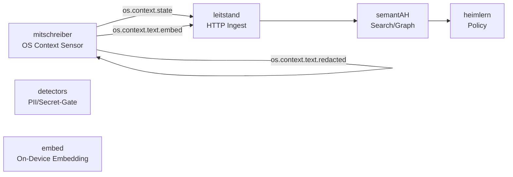

### 📄 merges/mitschreiber_merge_2510262237__.github_workflows.md

**Größe:** 3 KB | **md5:** `b0e8dedee2956a7e971cd4e27c238983`

```markdown
### 📄 .github/workflows/ci.yml

**Größe:** 440 B | **md5:** `f25f21901603a9b90af6e52e7ad71339`

```yaml
name: CI
on:
  push:
    branches: [ main ]
  pull_request:
permissions:
  contents: read
concurrency:
  group: ${{ github.workflow }}-${{ github.ref }}
  cancel-in-progress: true

jobs:
  ci:
    # Keep the pinned SHA in sync with documentation and CONTRACTS_REF in validate.yml.
    uses: heimgewebe/metarepo/.github/workflows/reusable-ci.yml@78674c7159fb4c623cf3d65e978e4e5d6ca699bb
    with:
      run_lint: true
      run_tests: false
```

### 📄 .github/workflows/validate.yml

**Größe:** 2 KB | **md5:** `b73fff258353c0ccb6022cfa44154828`

```yaml
name: Validate JSONL
on:
  push:
    branches: [ main ]
  pull_request:
  workflow_dispatch:
permissions:
  contents: read
concurrency:
  group: ${{ github.workflow }}-${{ github.ref }}
  cancel-in-progress: true

env:
  CONTRACTS_REF: 78674c7159fb4c623cf3d65e978e4e5d6ca699bb

jobs:
  contract-sanity:
    runs-on: ubuntu-latest
    timeout-minutes: 5
    permissions:
      contents: read
    strategy:
      fail-fast: false
      matrix:
        include:
          - stream: state
            schema_file: os.context.state.schema.json
          - stream: embed
            schema_file: os.context.text.embed.schema.json
          - stream: redacted
            schema_file: os.context.text.redacted.schema.json
    steps:
      - name: Check schema availability (${{ matrix.stream }})
        env:
          SCHEMA_URL: https://raw.githubusercontent.com/heimgewebe/metarepo/${{ env.CONTRACTS_REF }}/contracts/${{ matrix.schema_file }}
        run: curl -fsSL --retry 3 --retry-delay 2 --max-time 10 "$SCHEMA_URL" >/dev/null

  validate-state:
    needs: contract-sanity
    timeout-minutes: 10
    # Keep the pinned SHA in sync with CONTRACTS_REF above.
    uses: heimgewebe/metarepo/.github/workflows/reusable-validate-jsonl.yml@78674c7159fb4c623cf3d65e978e4e5d6ca699bb
    with:
      jsonl_paths_list: |
        fixtures/mitschreiber/*.jsonl
      schema_url: https://raw.githubusercontent.com/heimgewebe/metarepo/${{ env.CONTRACTS_REF }}/contracts/os.context.state.schema.json

  # Beispiel für weitere Streams (später aktivieren):
  # validate-embed:
  #   # Keep the pinned SHA in sync with CONTRACTS_REF above.
  #   uses: heimgewebe/metarepo/.github/workflows/reusable-validate-jsonl.yml@78674c7159fb4c623cf3d65e978e4e5d6ca699bb
  #   with:
  #     jsonl_paths_list: fixtures/mitschreiber/embed*.jsonl
  #     schema_url: https://raw.githubusercontent.com/heimgewebe/metarepo/${{ env.CONTRACTS_REF }}/contracts/os.context.text.embed.schema.json
```
```

### 📄 merges/mitschreiber_merge_2510262237__contracts.md

**Größe:** 2 KB | **md5:** `9c5719f9f1267b7ae7a34eed6422bc87`

```markdown
### 📄 contracts/os.context.text.embed.schema.json

**Größe:** 2 KB | **md5:** `ef1055b39b46e8dac4d85d5811c7efb9`

```json
{
  "$schema": "https://json-schema.org/draft/2020-12/schema",
  "$id": "https://schemas.heimgewebe.org/os.context.text.embed.schema.json",
  "title": "OS Context Text Embed Event",
  "description": "Contract für persistierbare OS-Kontext-Events ohne Rohtext (JSONL: 1 Objekt pro Zeile).",
  "type": "object",
  "additionalProperties": false,
  "properties": {
    "ts": {
      "type": "string",
      "format": "date-time",
      "description": "Zeitstempel des Events im ISO-8601-Format."
    },
    "source": {
      "type": "string",
      "const": "os.context.text.embed",
      "description": "Event-Type Identifier."
    },
    "session": {
      "type": "string",
      "minLength": 1,
      "description": "Session- oder Conversation-Identifier des mitschreiber-Dienstes."
    },
    "app": {
      "type": "string",
      "pattern": "^[a-z0-9._-]{1,128}$",
      "description": "Name der aktiven Anwendung (lowercase, Ziffern, Punkt, Unterstrich, Bindestrich)."
    },
    "window": {
      "type": "string",
      "minLength": 1,
      "description": "Fenster- oder Dokumenttitel des Events."
    },
    "keyphrases": {
      "type": "array",
      "items": {
        "type": "string",
        "minLength": 1
      },
      "description": "Schlüsselbegriffe, extrahiert aus dem redigierten Kontext."
    },
    "embedding": {
      "type": "array",
      "items": {
        "type": "number"
      },
      "minItems": 1,
      "description": "Embedding-Vektor als Liste von Fließkommazahlen."
    },
    "hash_id": {
      "type": "string",
      "pattern": "^sha256:[a-f0-9]{64}$",
      "description": "Deterministischer SHA-256-Hash über die Snippet-Basisdaten."
    },
    "privacy": {
      "type": "object",
      "additionalProperties": false,
      "properties": {
        "raw_retained": {
          "type": "boolean",
          "const": false,
          "description": "Flag, ob Rohtext gespeichert wurde (immer false)."
        }
      },
      "required": ["raw_retained"],
      "description": "Privacy-Garantie für dieses Event."
    },
    "meta": {
      "type": "object",
      "description": "Optionale Metadaten (z. B. Modellbezeichner)."
    }
  },
  "required": [
    "ts",
    "source",
    "session",
    "app",
    "window",
    "keyphrases",
    "embedding",
    "hash_id",
    "privacy"
  ]
}
```
```

### 📄 merges/mitschreiber_merge_2510262237__crates_core_tests.md

**Größe:** 2 KB | **md5:** `d978f06a70ff96f486a6d11f0bc4ab55`

```markdown
### 📄 crates/core/tests/metrics_smoke.rs

**Größe:** 2 KB | **md5:** `9fa3b00d32fe55d8ef889e5485be0943`

```rust
//! Minimaler Smoke-Test für `/metrics`.
//!
//! Dieser Test ist bewusst als `#[ignore]` markiert, damit reguläre CI-Läufe
//! nicht scheitern, wenn kein Server läuft. Er kann gezielt aktiviert werden:
//!
//! ```bash
//! HAUSKI_TEST_BASE_URL="http://127.0.0.1:8080" \
//!   cargo test -p hauski-core --test metrics_smoke -- --ignored --nocapture
//! ```
//!
//! Erwartung: Ein laufender hausKI-Server (z. B. `hauski-cli serve`) exponiert
//! Prometheus-Metriken unter GET /metrics (Content-Type text/plain; version=0.0.4).

use reqwest::StatusCode;

fn base_url() -> String {
    std::env::var("HAUSKI_TEST_BASE_URL")
        .ok()
        .unwrap_or_else(|| "http://127.0.0.1:8080".to_string())
}

#[tokio::test]
#[ignore] // nur on-demand ausführen
async fn metrics_endpoint_exposes_prometheus_text() {
    let url = format!("{}/metrics", base_url().trim_end_matches('/'));
    let resp = reqwest::Client::new()
        .get(&url)
        .send()
        .await
        .expect("request to /metrics failed");

    assert_eq!(resp.status(), StatusCode::OK, "unexpected status for /metrics");

    // Content-Type sollte Prometheus-Textformat sein
    let ctype = resp
        .headers()
        .get(reqwest::header::CONTENT_TYPE)
        .and_then(|v| v.to_str().ok())
        .unwrap_or_default()
        .to_lowercase();
    assert!(
        ctype.contains("text/plain"),
        "unexpected content-type: {}",
        ctype
    );

    let body = resp.text().await.expect("reading response body failed");
    // Heuristik: Prometheus-Textformat enthält i. d. R. HELP/TYPE-Zeilen
    assert!(
        body.contains("# HELP") || body.contains("# TYPE"),
        "unexpected /metrics payload (length={}): first bytes: {:?}",
        body.len(),
        &body.as_bytes().get(0..64)
    );
}
```
```

### 📄 merges/mitschreiber_merge_2510262237__docs.md

**Größe:** 9 KB | **md5:** `d53ed1092096266ade8054ce26b2e86e`

```markdown
### 📄 docs/architecture.md

**Größe:** 1 KB | **md5:** `83866236f9238e2e70e2df5798dc635f`

```markdown
# Architektur

## Übersicht



---

## Komponenten

| Modul               | Aufgabe                                             |
| ------------------- | --------------------------------------------------- |
| `mitschreiber/core` | OS-Events sammeln (Fenster, Fokus, Input-Aktivität) |
| `detectors/pii`     | Regex + NER-basierte PII-Erkennung                  |
| `embed/`            | Embedding & Keyphrase-Extraktion (on-device)        |
| `sinks/`            | WAL/RAM-Speicher, Leitstand-HTTP-Client             |
| `config/`           | `.env` + Just-Integration                           |

---

## Betriebsfluss

1. **Sampler** liest Fokus & Aktivität (je 5 s)
2. **optional Text-Watcher** → Snippet-Buffer
3. **PII-Gate** prüft Tokens; ggf. maskiert
4. **Embedding-Worker** erzeugt Vektoren + Keyphrases
5. **Sink-Router**

   * persistiert `state` / `embed`
   * verwirft oder flüchtig speichert `redacted`
6. **HTTP-Client** sendet Events an `leitstand`

---

## Security

* Kein Zugriff auf Dateisysteminhalte
* Keine Netzwerk-Verbindungen außer `leitstand`
* Fail-Closed: Bei Gate-Fehler → kein Persist, kein Send
```

### 📄 docs/ci.md

**Größe:** 2 KB | **md5:** `5e58c820f30703561e2ea0bea85c4c41`

```markdown
# CI / Validierung

Dieses Repo nutzt die Reusable-Workflows aus dem **metarepo** (gepinnt auf Commit `78674c7159fb4c623cf3d65e978e4e5d6ca699bb`).

## JSONL-Validierung

```yaml
name: validate
on:
  push:
    branches: [main]
  pull_request:
  workflow_dispatch:

env:
  CONTRACTS_REF: 78674c7159fb4c623cf3d65e978e4e5d6ca699bb

jobs:
  contract-sanity:
    runs-on: ubuntu-latest
    timeout-minutes: 5
    permissions:
      contents: read
    strategy:
      fail-fast: false
      matrix:
        include:
          - stream: state
            schema_file: os.context.state.schema.json
          - stream: embed
            schema_file: os.context.text.embed.schema.json
          - stream: redacted
            schema_file: os.context.text.redacted.schema.json
    steps:
      - name: Check schema availability (${{ matrix.stream }})
        env:
          SCHEMA_URL: https://raw.githubusercontent.com/heimgewebe/metarepo/${{ env.CONTRACTS_REF }}/contracts/${{ matrix.schema_file }}
        run: curl -fsSL --retry 3 --retry-delay 2 --max-time 10 "$SCHEMA_URL" >/dev/null

  validate:
    needs: contract-sanity
    timeout-minutes: 10
    # Keep the pinned SHA in sync with CONTRACTS_REF above.
    uses: heimgewebe/metarepo/.github/workflows/reusable-validate-jsonl.yml@78674c7159fb4c623cf3d65e978e4e5d6ca699bb
    with:
      jsonl_paths_list: |
        fixtures/mitschreiber/*.jsonl
      schema_url: https://raw.githubusercontent.com/heimgewebe/metarepo/${{ env.CONTRACTS_REF }}/contracts/os.context.state.schema.json
```

Analog für `os.context.text.embed` und `os.context.text.redacted`.

---

## Lint / Tests

```yaml
jobs:
  ci:
    # Keep the pinned SHA in sync with CONTRACTS_REF in validate.yml.
    uses: heimgewebe/metarepo/.github/workflows/reusable-ci.yml@78674c7159fb4c623cf3d65e978e4e5d6ca699bb
    with:
      run_lint: true
      run_tests: false
```

---

## Badge (README)

```md

```
```

### 📄 docs/contracts.md

**Größe:** 2 KB | **md5:** `e37d8709184e32793ae8da88a80c48a6`

```markdown
# Contracts

Die Schemas liegen zentral im **metarepo** (gepinnt auf Commit `78674c7159fb4c623cf3d65e978e4e5d6ca699bb`):

| Event | Schema-Datei | Persistenz |
|--------|---------------|------------|
| `os.context.state` | [metarepo/contracts/os.context.state.schema.json](https://github.com/heimgewebe/metarepo/blob/78674c7159fb4c623cf3d65e978e4e5d6ca699bb/contracts/os.context.state.schema.json) | dauerhaft |
| `os.context.text.redacted` | [metarepo/contracts/os.context.text.redacted.schema.json](https://github.com/heimgewebe/metarepo/blob/78674c7159fb4c623cf3d65e978e4e5d6ca699bb/contracts/os.context.text.redacted.schema.json) | flüchtig |
| `os.context.text.embed` | [metarepo/contracts/os.context.text.embed.schema.json](https://github.com/heimgewebe/metarepo/blob/78674c7159fb4c623cf3d65e978e4e5d6ca699bb/contracts/os.context.text.embed.schema.json) | dauerhaft |

Validierung per Reusable-Workflow:

```yaml
env:
  CONTRACTS_REF: 78674c7159fb4c623cf3d65e978e4e5d6ca699bb

jobs:
  contract-sanity:
    runs-on: ubuntu-latest
    timeout-minutes: 5
    permissions:
      contents: read
    strategy:
      fail-fast: false
      matrix:
        include:
          - stream: state
            schema_file: os.context.state.schema.json
          - stream: embed
            schema_file: os.context.text.embed.schema.json
          - stream: redacted
            schema_file: os.context.text.redacted.schema.json
    steps:
      - name: Check schema availability (${{ matrix.stream }})
        env:
          SCHEMA_URL: https://raw.githubusercontent.com/heimgewebe/metarepo/${{ env.CONTRACTS_REF }}/contracts/${{ matrix.schema_file }}
        run: curl -fsSL --retry 3 --retry-delay 2 --max-time 10 "$SCHEMA_URL" >/dev/null

  validate:
    needs: contract-sanity
    timeout-minutes: 10
    # Keep the pinned SHA in sync with CONTRACTS_REF above.
    uses: heimgewebe/metarepo/.github/workflows/reusable-validate-jsonl.yml@78674c7159fb4c623cf3d65e978e4e5d6ca699bb
    with:
      jsonl_paths_list: |
        fixtures/mitschreiber/*.jsonl
      schema_url: https://raw.githubusercontent.com/heimgewebe/metarepo/${{ env.CONTRACTS_REF }}/contracts/os.context.state.schema.json
```

```
```

### 📄 docs/devcontainer.md

**Größe:** 1 KB | **md5:** `081799005cde3973a090a70b689b7d95`

```markdown
# Devcontainer / Codespaces Setup

## Basis

Verwende `mcr.microsoft.com/devcontainers/base:ubuntu`  
oder den Codex-Container „universal“ mit vorinstallierten Paketen.

## Schritte

1. `.devcontainer/devcontainer.json`
   ```json
   {
     "name": "mitschreiber",
     "image": "mcr.microsoft.com/devcontainers/base:ubuntu",
     "features": {
       "ghcr.io/devcontainers/features/python:1": { "version": "3.11" }
     },
     "postCreateCommand": "bash .devcontainer/postCreate.sh"
   }
```

2. `.devcontainer/postCreate.sh`

   ```bash
   curl -LsSf https://astral.sh/uv/install.sh | sh
   sudo apt-get update && sudo apt-get install -y just
   uv sync --frozen || uv sync
   ```
3. `.env.example` kopieren und Secrets anpassen
4. Start: `just dev`

## Secrets

| Name                          | Beschreibung                |
| ----------------------------- | --------------------------- |
| `LEITSTAND_INGEST_URL`        | Ziel-Endpoint               |
| `LEITSTAND_TOKEN`             | Auth-Token                  |
| `LEITSTAND_MTLS_CERT` / `KEY` | Base64-codierte Zertifikate |
| `OPENAI_API_KEY`              | optional für Embeddings     |
```

### 📄 docs/privacy.md

**Größe:** 938 B | **md5:** `8c987fb39ed78dd7a533d4d05f0a7f74`

```markdown
# Privacy & Redaction

## Grundsätze

1. **Minimierung:** Es werden nur Metadaten, Keyphrases und Embeddings gespeichert.  
2. **Trennung:** Rohtext bleibt maximal im RAM.  
3. **Transparenz:** Jede Nachricht enthält ein `privacy`-Objekt.  
4. **Audit:** `privacy.raw_retained` ist immer `false`.

---

## Redaction-Pipeline

```text

Keyboard Stream
↓
Tokenizer
↓
PII-Detector (Regex + NER)
↓
Redactor → snippet.redacted (RAM/WAL, TTL ≤ 60 s)
↓
Embedder → embedding + keyphrases
↓
Leitstand-Sink (JSONL append)

```

---

## PII/Secret-Erkennung

- Regex-Patterns (IBAN, Mail, JWT, API-Keys)
- Named-Entity-Model (PERSON, ORG, LOCATION)
- Confidence-Threshold (`PII_MIN_CONFIDENCE`)
- Aktion (`PII_ACTION`):  
  `drop_and_shred` | `mask` | `allow`

---

## Opt-In-Modus

- Standard: `MITSCHREIBER_ENABLE_TEXT=false`
- Aktiviert nur durch bewusste Änderung in `.env`
- Hotkey `Ctrl + Alt + M` pausiert Erfassung sofort
```

### 📄 docs/runbook.md

**Größe:** 1 KB | **md5:** `b537f81d05ea60177c528b5a6b2b7f07`

```markdown
# Runbook – Betrieb & Entwicklung

## Lokale Entwicklung

```bash
uv sync
cp .env.example .env
just dev

```

**Hotkeys**

| Tastenkombination | Aktion                            |
| ----------------- | --------------------------------- |
| Ctrl + Alt + M    | Mitschreiber pausieren/fortsetzen |
| Ctrl + Alt + L    | Letzten Status loggen             |

---

## Fixtures erzeugen

```bash
just emit:fixtures
```

legt Beispiel-Events unter `fixtures/mitschreiber/` an.

---

## Validierung

```bash
just validate:fixtures
```

nutzt den metarepo-Workflow `.github/workflows/reusable-validate-jsonl.yml`.

---

## Logs & Troubleshooting

* Laufzeitlogs: `.runtime/logs/*.log`
* WAL-Einträge: `.runtime/wal/`
* Fehlerdiagnose: `just doctor` (geplant)

---

## Deployment (autonom)

1. systemd-Service anlegen:

   ```
   [Unit]
   Description=Mitschreiber Sensor
   After=network.target

   [Service]
   ExecStart=/usr/bin/env uv run python -m mitschreiber
   WorkingDirectory=/home/user/mitschreiber
   Restart=on-failure
   ```

2. Aktivieren:

```bash
sudo systemctl enable --now mitschreiber
```
```
```

### 📄 merges/mitschreiber_merge_2510262237__docs_adrs.md

**Größe:** 2 KB | **md5:** `43c366a677f2c93647e2a6f4a74986e2`

```markdown
### 📄 docs/adrs/ADR-0001-toolchain-strategy.md

**Größe:** 2 KB | **md5:** `94ad6ec6901a7ee60e25202af60e7688`

```markdown
# ADR-0001: Einheitliche Toolchain-Strategie (Rust, Python, UV)

**Status:** Accepted  
**Datum:** 2025-10-23  
**Autor:** hausKI Team

## Kontext
In der Vergangenheit drifteten Toolchain-Versionen zwischen lokaler Entwicklung, CI
und DevContainer auseinander (Rust-Toolchain, Python, UV). Das führte zu
unreproduzierbaren Builds und inkonsistenten Abhängigkeiten.

## Entscheidung
Wir führen eine zentrale, maschinenlesbare Datei ein (z. B. `toolchain.versions.yml`),
aus der **CI-Workflows** und **DevContainer** ihre Versionen lesen. Ziel: keine
hartcodierten Versionsangaben mehr an mehreren Stellen.

Beispiel:
```yaml
rust: "stable"        # oder fix: "1.81.0"
python: "3.12"
uv: "0.7.0"
```

### CI
- GitHub Actions lesen (bei Bedarf via `actions/github-script` oder einfachem `yq/jq`)
  die Werte und setzen `RUST_TOOLCHAIN`, `PYTHON_VERSION`, `UV_VERSION`.
- Fallback bleibt `stable`, falls Datei nicht existiert.

### DevContainer/Local
- DevContainer (oder `.wgx/profile.yml`/`pyproject.toml`) übernimmt die zentralen
  Versionen und pinnt diese deterministisch.

## Konsequenzen
- **Pro:** Reproduzierbare Builds, weniger Aufwand bei Upgrades, einheitliche
  Dokumentation.
- **Contra:** Kleiner Initialaufwand zur Umstellung der Workflows und Container.

## Alternativen
- Versionsangaben weiterhin dezentral pflegen (verworfen wegen Drift-Risiko).

## Folgearbeiten
1. `toolchain.versions.yml` im Repo anlegen (Werte s. oben).
2. CI-Workflows so anpassen, dass sie daraus lesen (ohne harte Defaults).
3. DevContainer/`.wgx` an zentrale Datei koppeln.
```
```

### 📄 merges/mitschreiber_merge_2510262237__docs_contracts.md

**Größe:** 1 KB | **md5:** `12ef44c0609f73cfc7fd752e1a90ebb5`

```markdown
### 📄 docs/contracts/index.md

**Größe:** 415 B | **md5:** `f3195ee8ee8fdbe69af2de3a2769e6ac`

```markdown
# Contracts Index

| Schema | Beschreibung | Producer | Consumer |
| ------ | ------------- | -------- | -------- |
| [`contracts/os.context.text.embed.schema.json`](../../contracts/os.context.text.embed.schema.json) | Kontext-Embeddings ohne Rohtext | `mitschreiber` | `leitstand`, `semantAH` |

Weitere Dokumentation:

- [OS Context Contracts](./os-context.md) – Details zu mitschreiber → leitstand/semantAH.
```

### 📄 docs/contracts/os-context.md

**Größe:** 456 B | **md5:** `bf701e006e6e150286efa4b5787e6085`

```markdown
# Contracts: OS Context (mitschreiber → leitstand/semantAH)

Dieses Dokument beschreibt die auf Datenschutz ausgelegten Contracts für kontextbezogene OS-Signale des mitschreiber-Dienstes.

- `os.context.text.embed` – persistierbare Embeddings mit Keyphrases
- `os.context.text.redacted` – flüchtige redigierte Snippets
- `os.context.state` – Metadaten zu aktiven Anwendungen

Alle Events enthalten ein `privacy`-Objekt mit `raw_retained: false`.
```
```

### 📄 merges/mitschreiber_merge_2510262237__fixtures_mitschreiber.md

**Größe:** 418 B | **md5:** `d7d64198d56de4991c96f2163d699ba3`

```markdown
### 📄 fixtures/mitschreiber/.gitkeep

**Größe:** 0 B | **md5:** `d41d8cd98f00b204e9800998ecf8427e`

```plaintext

```

### 📄 fixtures/mitschreiber/state.demo.jsonl

**Größe:** 161 B | **md5:** `c7a49615c4911abba3e481ab21bd82f4`

```plaintext
{"ts":"2025-01-01T12:00:00Z","source":"os.context.state","session":"demo","app":"vscode","window":"README.md – mitschreiber","privacy":{"raw_retained":false}}
```
```

### 📄 merges/mitschreiber_merge_2510262237__index.md

**Größe:** 7 KB | **md5:** `a721eed23633439a1846422c3d1942bc`

```markdown
# Ordner-Merge: mitschreiber

**Zeitpunkt:** 2025-10-26 22:37
**Quelle:** `/home/alex/repos/mitschreiber`
**Dateien (gefunden):** 20
**Gesamtgröße (roh):** 28 KB

**Exclude:** ['.gitignore']

## 📁 Struktur

- mitschreiber/
  - .env.example
  - .gitignore
  - .hauski-reports
  - Justfile
  - README.md
  - renovate.json
  - docs/
    - architecture.md
    - ci.md
    - contracts.md
    - devcontainer.md
    - privacy.md
    - runbook.md
    - adrs/
      - ADR-0001-toolchain-strategy.md
    - contracts/
      - index.md
      - os-context.md
  - .github/
    - workflows/
      - ci.yml
      - validate.yml
  - fixtures/
    - mitschreiber/
      - .gitkeep
      - state.demo.jsonl
  - .git/
    - FETCH_HEAD
    - HEAD
    - ORIG_HEAD
    - config
    - index
    - hooks/
      - pre-push
    - refs/
      - remotes/
        - origin/
          - improve-metrics-smoke-test
          - main
          - codex/
            - add-complete-documentation-for-mitschreiber
            - locate-errors-in-the-code
      - tags/
      - heads/
        - main
        - backup/
          - main-20251023-114030
          - main-20251025-233734
    - logs/
      - HEAD
      - refs/
        - remotes/
          - origin/
            - improve-metrics-smoke-test
            - main
            - codex/
              - add-complete-documentation-for-mitschreiber
              - locate-errors-in-the-code
        - heads/
          - main
          - backup/
            - main-20251023-114030
            - main-20251025-233734
    - objects/
      - c7/
        - 3590c0142698b6226673cb3c9bc90673ef4a20
      - c9/
        - eeddc9accfec76915b1f9d3a8af2738b276b1d
        - f0254e0b990ad0eaf4f0be2932992f2b384114
      - 23/
        - 9915487e37fd133d0e2bfdd152d327048cd10f
      - 72/
        - 93d7cafd705ca27a25728ab60d002adfa75cc4
      - 0e/
        - bf387b70fdaa478b7394a6cdf2561b4740536d
      - 54/
        - abf6d492868056734102733b1d61e0b2817756
      - 4f/
        - cf938346966f0a76913b5917a6758b79913a05
      - fd/
        - 3982479d01ca5b49ad510382398c031a7b6a77
        - b8bdb61264e1550065b5b9c61f1e98582e8e3f
      - 8f/
        - 9988e4ff71417ff51883f61752fe83a8832cf0
      - 29/
        - 5beb940fe596d10d1a447657487640aa11bd1c
      - 14/
        - 97e66483709608ed4f959c8e03ebbaf1f3e49a
      - 77/
        - d124ddddc3ccf1f449bf5b98c0d28c6c68f08e
      - 6a/
        - a24c074aa6c1c765ed1e30949c22d4d0b3d46b
      - c6/
        - 722eca9ac6e925b1a406cd9829e67ee1ae31d3
      - ab/
        - 0cf283e46435bbdf60d3cfc7c867c4cab8a076
      - 57/
        - e83bf85e398fa33b955485b0bf4ae7968c652c
      - pack/
      - 9b/
        - d0d055f6649375a6915acc5dce5d2ec1e4dcc1
      - 92/
        - df1e77fda84e0379f7fe0b18eb80c7ec829c11
      - e9/
        - 2041b7a61cd69692ee10ed680cd281e138f507
      - 2e/
        - ba61a9882d30b58b0e9d93b59e97b4b03fc8e6
      - c4/
        - a2b0b86c2fe7149eaa03982e633da2a8e5149f
      - e6/
        - 9de29bb2d1d6434b8b29ae775ad8c2e48c5391
      - 5b/
        - 4c4beccbb8976a475d1eedbd4f1e091ea197f2
      - 8b/
        - 137891791fe96927ad78e64b0aad7bded08bdc
        - a94824d9c81b44a59c7da5622a110197fd7597
      - fe/
        - f6bc47dfa70c53725e6b923621f30b4e313031
      - 7a/
        - 1e3d7f415eb157ceac2cc65d1d86dafca5b6a8
      - 28/
        - 014c6067e0a6188425c47a13a057924b1c20aa
      - fb/
        - 16d55a05784284a5fa9526f465ae3942672dfd
      - 1b/
        - 59a707269ac362c64b1c8e53a5994d4222c88b
      - 69/
        - 80febee42e7ce9051f3a9ab804981abc92a5f7
      - 37/
        - 61973e3408bfc31b62666b6bf30618afebefa6
      - 31/
        - 1c1c861c0b4a692922ddd16f8d428d063d0872
      - ce/
        - a7bcf4af2974622738a9374fe9ddc6dcfa39a6
      - b3/
        - d771367e52411f2aaf4ea61a1b6bae3c2bd6af
      - 44/
        - 0c40db31f9790a466bc41ebaf9f6722bf67abe
      - 81/
        - 84f5722f0842ce5cd80aa6b8f5b6fd3eab162d
      - 6e/
        - 46cc6da4932db411399dc2fcb30ddc1d425bae
      - 10/
        - b6f9920be55b95ab2ddbf6f8627d1c1873b72a
      - e1/
        - f4b38a722fd6e6eee061d66a99f97081ce70cd
      - b4/
        - 86469df09c72c7e6c9dc1418a8867b99c2a90e
      - ae/
        - 19a6dac5c3b360d86c1bbd647ff2446df86142
        - 5aa810b9ee52f8598886155b77628807cfb605
      - dc/
        - 0d25e914f9661efda90acb3a16f65a7188f767
      - 99/
        - 80106cee070a250251188410e1299fb3ad5092
      - 7f/
        - 621189c1961b90dc39c7ae8a4179f3e36f2665
      - 25/
        - a6f90eb7db2b0ddad00e694e87003e8d09d324
      - f4/
        - d4c5759bd7df89a21addc17fdb24315b2e1225
      - db/
        - 10ea9abd6da76a09d261f96e04066786f2ab69
      - info/
      - 86/
        - baaa8828944f3cec499b5ae929a113406e7a56
      - 09/
        - 9bdc054b04052425b0086d504d2a8c5b5ddd31
      - cf/
        - 08441a53b2e38544841dec8c69507cf184b948
      - ef/
        - 5d6f120a37827d354b8a2869bbbbdcd80336c9
      - 7e/
        - 9c8efdf93e3dfc2a317765c01e1e0f611de411
        - d2607b5066a7ffccdd50c63100222a9b663d22
  - merges/
    - mitschreiber_merge_2510262237__index.md
  - crates/
    - core/
      - tests/
        - metrics_smoke.rs
  - contracts/
    - os.context.text.embed.schema.json

## 📦 Inhalte (Chunks)

- .env.example → `mitschreiber_merge_2510262237__root.md`
- .gitignore → `mitschreiber_merge_2510262237__root.md`
- Justfile → `mitschreiber_merge_2510262237__root.md`
- README.md → `mitschreiber_merge_2510262237__root.md`
- renovate.json → `mitschreiber_merge_2510262237__root.md`
- docs/architecture.md → `mitschreiber_merge_2510262237__docs.md`
- docs/ci.md → `mitschreiber_merge_2510262237__docs.md`
- docs/contracts.md → `mitschreiber_merge_2510262237__docs.md`
- docs/devcontainer.md → `mitschreiber_merge_2510262237__docs.md`
- docs/privacy.md → `mitschreiber_merge_2510262237__docs.md`
- docs/runbook.md → `mitschreiber_merge_2510262237__docs.md`
- docs/adrs/ADR-0001-toolchain-strategy.md → `mitschreiber_merge_2510262237__docs_adrs.md`
- docs/contracts/index.md → `mitschreiber_merge_2510262237__docs_contracts.md`
- docs/contracts/os-context.md → `mitschreiber_merge_2510262237__docs_contracts.md`
- .github/workflows/ci.yml → `mitschreiber_merge_2510262237__.github_workflows.md`
- .github/workflows/validate.yml → `mitschreiber_merge_2510262237__.github_workflows.md`
- fixtures/mitschreiber/.gitkeep → `mitschreiber_merge_2510262237__fixtures_mitschreiber.md`
- fixtures/mitschreiber/state.demo.jsonl → `mitschreiber_merge_2510262237__fixtures_mitschreiber.md`
- crates/core/tests/metrics_smoke.rs → `mitschreiber_merge_2510262237__crates_core_tests.md`
- contracts/os.context.text.embed.schema.json → `mitschreiber_merge_2510262237__contracts.md`
```

### 📄 merges/mitschreiber_merge_2510262237__part001.md

**Größe:** 43 B | **md5:** `ad150e6cdda3920dbef4d54c92745d83`

```markdown
<!-- chunk:1 created:2025-10-26 22:37 -->
```

### 📄 merges/mitschreiber_merge_2510262237__root.md

**Größe:** 11 KB | **md5:** `a622a3dd9ef0aef2ecc23c23072de82c`

```markdown
### 📄 .env.example

**Größe:** 413 B | **md5:** `3232b8b39e8a23994aadb95cbf562edb`

```plaintext
# Mitschreiber – Beispielkonfiguration
# Kopiere diese Datei zu ".env" und passe Werte an.

# Ziel für persistente Events (leitstand)
LEITSTAND_INGEST_URL=http://localhost:8080/ingest
LEITSTAND_TOKEN=
# optional mTLS (Base64, einzeilig)
LEITSTAND_MTLS_CERT=
LEITSTAND_MTLS_KEY=

# Text-Mitschnitt bewusst aktivieren (Opt-in)
MITSCHREIBER_ENABLE_TEXT=false

# Embeddings (lokal/optional extern)
OPENAI_API_KEY=
```

### 📄 .gitignore

**Größe:** 163 B | **md5:** `6ce5f83db28838f8355b7052763cef55`

```plaintext
# Python / uv
__pycache__/
.venv/
.uv/
*.pyc

# Runtime
.runtime/

# Env
.env

# Editors
.DS_Store
.idea/
.vscode/

# Fixtures generated
fixtures/**/*.generated.*
```

### 📄 Justfile

**Größe:** 665 B | **md5:** `1ded87217ca56f68ae0a697895dce654`

```plaintext
set shell := ["bash", "-eu", "-o", "pipefail", "-c"]

dev:
    uv run python -m mitschreiber

emit:fixtures:
    @mkdir -p fixtures/mitschreiber
    @echo '{"ts":"2025-01-01T12:00:00Z","source":"os.context.state","session":"demo","app":"vscode","window":"README.md – mitschreiber","privacy":{"raw_retained":false}}' > fixtures/mitschreiber/state.demo.jsonl
    @echo 'OK: fixtures/mitschreiber/* angelegt'

validate:fixtures:
    @echo "→ Prüfe fixtures via reusable-validate-jsonl (GitHub CI). Lokal kannst du ajv-cli nutzen:"
    @echo "  ajv validate --spec=draft2020 -s contracts/os.context.text.embed.schema.json -d fixtures/mitschreiber/*.jsonl || true"
```

### 📄 README.md

**Größe:** 2 KB | **md5:** `9f486fe036f195ac63807891525de13c`

```markdown
# mitschreiber


Reusable-Workflows und Schemas sind auf Commit `78674c7159fb4c623cf3d65e978e4e5d6ca699bb` gepinnt.

On-device Kontext-Schreiber des **Heimgewebe-Ökosystems**.
Erfasst aktive Anwendungen, Fenster-Titel, Tipp-Intensität und – bei explizitem Opt-in – redigierte Text-Kontexte.  
Keine Cloud, kein Rohtext, kein Tracking.

---

### Kernrollen

| Rolle | Beschreibung |
|-------|---------------|
| **Producer** | mitschreiber (Erfassung, Redaction, Embedding) |
| **Consumer** | leitstand (Ingest), semantAH (Suche/Graph), heimlern (Policy-Feedback) |
| **Contracts** | aus metarepo (gepinnt auf `78674c7159fb4c623cf3d65e978e4e5d6ca699bb`) – `os.context.*` |

---

## Features

- **Offline-First, Privacy-First**
- **App-Kontext-Signale:** aktive Anwendung, Fenster-Titel, Aktivitäts-Intensität
- **Redigierte Text-Snippets (Opt-in):** flüchtig im RAM/WAL
- **Embeddings + Keyphrases:** persistierbar, ohne Rohtext
- **PII-/Secret-Gate:** erkennt und maskiert sensible Daten
- **Leitstand-Anbindung:** JSONL-Event-Streams (`feed.jsonl`-kompatibel)

---

## Datenflüsse

```text
mitschreiber
├─ emits os.context.state          → leitstand ingest
├─ emits os.context.text.redacted  → RAM/WAL (flüchtig)
└─ emits os.context.text.embed     → leitstand ingest → semantAH
```

---

## Quickstart

```bash
# Abhängigkeiten
uv sync --frozen
cp .env.example .env

# Start
uv run python -m mitschreiber
```

oder via Just:

```bash
just dev
```

---

## Privacy-Prinzipien

1. **Keine Speicherung von Rohtext**
2. **Redaction & Dropping vor Persistenz**
3. **TTL ≤ 60 s für flüchtige Daten**
4. **Opt-in-Erfassung mit Hotkey-Pause**
5. **Auditierbarer Privacy-Status** (`privacy.raw_retained=false`)

Details siehe [`docs/privacy.md`](docs/privacy.md)

---

## Architektur & Verträge

* Technische Übersicht: [`docs/architecture.md`](docs/architecture.md)
* Contracts-Übersicht: [`docs/contracts.md`](docs/contracts.md)

---

## Entwicklung & CI

* [`docs/runbook.md`](docs/runbook.md) – Alltagsablauf
* [`docs/devcontainer.md`](docs/devcontainer.md) – Setup-Anleitung
* [`docs/ci.md`](docs/ci.md) – Validierung & Reusable-Workflows

---

## Lizenz

MIT
```

### 📄 renovate.json

**Größe:** 7 KB | **md5:** `4e60b964da571d28f65f8f295f942a9d`

```json
{
  "$schema": "https://docs.renovatebot.com/renovate-schema.json",
  "extends": [
    "config:recommended"
  ],
  "dependencyDashboard": true,
  "prConcurrentLimit": 2,
  "labels": [
    "deps",
    "contracts-pin"
  ],
  "packageRules": [
    {
      "matchManagers": ["regex"],
      "matchPackageNames": ["heimgewebe/metarepo contracts"],
      "automerge": true,
      "automergeType": "branch"
    }
  ],
  "enabledManagers": [
    "regex"
  ],
  "regexManagers": [
    {
      "description": "Pin metarepo contracts ref across workflows and docs",
      "fileMatch": [
        "^[.]github/workflows/validate[.]yml$",
        "^docs/ci[.]md$",
        "^docs/contracts[.]md$"
      ],
      "matchStrings": [
        "  CONTRACTS_REF: (?<currentDigest>[0-9a-f]{40})"
      ],
      "depNameTemplate": "heimgewebe/metarepo contracts",
      "datasourceTemplate": "github-tags",
      "lookupNameTemplate": "heimgewebe/metarepo",
      "extractVersionTemplate": "contracts-v(?<version>[0-9]+[.][0-9]+[.][0-9]+)",
      "versioningTemplate": "semver",
      "replaceStringTemplate": "  CONTRACTS_REF: {{lookupResult.sha}}"
    },
    {
      "description": "Pinned reusable JSONL validator reference",
      "fileMatch": [
        "^[.]github/workflows/validate[.]yml$",
        "^docs/ci[.]md$",
        "^docs/contracts[.]md$"
      ],
      "matchStrings": [
        "    uses: heimgewebe/metarepo/[.]github/workflows/reusable-validate-jsonl[.]yml@(?<currentDigest>[0-9a-f]{40})"
      ],
      "depNameTemplate": "heimgewebe/metarepo contracts",
      "datasourceTemplate": "github-tags",
      "lookupNameTemplate": "heimgewebe/metarepo",
      "extractVersionTemplate": "contracts-v(?<version>[0-9]+[.][0-9]+[.][0-9]+)",
      "versioningTemplate": "semver",
      "replaceStringTemplate": "    uses: heimgewebe/metarepo/.github/workflows/reusable-validate-jsonl.yml@{{lookupResult.sha}}"
    },
    {
      "description": "Pinned reusable CI workflow reference",
      "fileMatch": [
        "^[.]github/workflows/ci[.]yml$",
        "^docs/ci[.]md$"
      ],
      "matchStrings": [
        "    uses: heimgewebe/metarepo/[.]github/workflows/reusable-ci[.]yml@(?<currentDigest>[0-9a-f]{40})"
      ],
      "depNameTemplate": "heimgewebe/metarepo contracts",
      "datasourceTemplate": "github-tags",
      "lookupNameTemplate": "heimgewebe/metarepo",
      "extractVersionTemplate": "contracts-v(?<version>[0-9]+[.][0-9]+[.][0-9]+)",
      "versioningTemplate": "semver",
      "replaceStringTemplate": "    uses: heimgewebe/metarepo/.github/workflows/reusable-ci.yml@{{lookupResult.sha}}"
    },
    {
      "description": "README commit note",
      "fileMatch": [
        "^README[.]md$"
      ],
      "matchStrings": [
        "Reusable-Workflows und Schemas sind auf Commit `(?<currentDigest>[0-9a-f]{40})` gepinnt[.]"
      ],
      "depNameTemplate": "heimgewebe/metarepo contracts",
      "datasourceTemplate": "github-tags",
      "lookupNameTemplate": "heimgewebe/metarepo",
      "extractVersionTemplate": "contracts-v(?<version>[0-9]+[.][0-9]+[.][0-9]+)",
      "versioningTemplate": "semver",
      "replaceStringTemplate": "Reusable-Workflows und Schemas sind auf Commit `{{lookupResult.sha}}` gepinnt."
    },
    {
      "description": "CI documentation intro pin note",
      "fileMatch": [
        "^docs/ci[.]md$"
      ],
      "matchStrings": [
        "Dieses Repo nutzt die Reusable-Workflows aus dem [*][*]metarepo[*][*] [(]gepinnt auf Commit `(?<currentDigest>[0-9a-f]{40})`[)]."
      ],
      "depNameTemplate": "heimgewebe/metarepo contracts",
      "datasourceTemplate": "github-tags",
      "lookupNameTemplate": "heimgewebe/metarepo",
      "extractVersionTemplate": "contracts-v(?<version>[0-9]+[.][0-9]+[.][0-9]+)",
      "versioningTemplate": "semver",
      "replaceStringTemplate": "Dieses Repo nutzt die Reusable-Workflows aus dem **metarepo** (gepinnt auf Commit `{{lookupResult.sha}}`)."
    },
    {
      "description": "Contracts documentation intro pin note",
      "fileMatch": [
        "^docs/contracts[.]md$"
      ],
      "matchStrings": [
        "Die Schemas liegen zentral im [*][*]metarepo[*][*] [(]gepinnt auf Commit `(?<currentDigest>[0-9a-f]{40})`[)]:"
      ],
      "depNameTemplate": "heimgewebe/metarepo contracts",
      "datasourceTemplate": "github-tags",
      "lookupNameTemplate": "heimgewebe/metarepo",
      "extractVersionTemplate": "contracts-v(?<version>[0-9]+[.][0-9]+[.][0-9]+)",
      "versioningTemplate": "semver",
      "replaceStringTemplate": "Die Schemas liegen zentral im **metarepo** (gepinnt auf Commit `{{lookupResult.sha}}`):"
    },
    {
      "description": "Contracts table (state schema)",
      "fileMatch": [
        "^docs/contracts[.]md$"
      ],
      "matchStrings": [
        "https://github[.]com/heimgewebe/metarepo/blob/(?<currentDigest>[0-9a-f]{40})/contracts/os[.]context[.]state[.]schema[.]json"
      ],
      "depNameTemplate": "heimgewebe/metarepo contracts",
      "datasourceTemplate": "github-tags",
      "lookupNameTemplate": "heimgewebe/metarepo",
      "extractVersionTemplate": "contracts-v(?<version>[0-9]+[.][0-9]+[.][0-9]+)",
      "versioningTemplate": "semver",
      "replaceStringTemplate": "https://github.com/heimgewebe/metarepo/blob/{{lookupResult.sha}}/contracts/os.context.state.schema.json"
    },
    {
      "description": "Contracts table (embed schema)",
      "fileMatch": [
        "^docs/contracts[.]md$"
      ],
      "matchStrings": [
        "https://github[.]com/heimgewebe/metarepo/blob/(?<currentDigest>[0-9a-f]{40})/contracts/os[.]context[.]text[.]embed[.]schema[.]json"
      ],
      "depNameTemplate": "heimgewebe/metarepo contracts",
      "datasourceTemplate": "github-tags",
      "lookupNameTemplate": "heimgewebe/metarepo",
      "extractVersionTemplate": "contracts-v(?<version>[0-9]+[.][0-9]+[.][0-9]+)",
      "versioningTemplate": "semver",
      "replaceStringTemplate": "https://github.com/heimgewebe/metarepo/blob/{{lookupResult.sha}}/contracts/os.context.text.embed.schema.json"
    },
    {
      "description": "Contracts table (redacted schema)",
      "fileMatch": [
        "^docs/contracts[.]md$"
      ],
      "matchStrings": [
        "https://github[.]com/heimgewebe/metarepo/blob/(?<currentDigest>[0-9a-f]{40})/contracts/os[.]context[.]text[.]redacted[.]schema[.]json"
      ],
      "depNameTemplate": "heimgewebe/metarepo contracts",
      "datasourceTemplate": "github-tags",
      "lookupNameTemplate": "heimgewebe/metarepo",
        "extractVersionTemplate": "contracts-v(?<version>[0-9]+[.][0-9]+[.][0-9]+)",
      "versioningTemplate": "semver",
      "replaceStringTemplate": "https://github.com/heimgewebe/metarepo/blob/{{lookupResult.sha}}/contracts/os.context.text.redacted.schema.json"
    }
  ]
}
```
```

